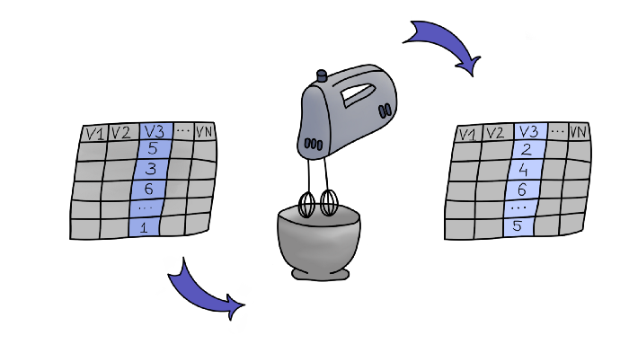

```{r setup, include=FALSE}
knitr::opts_chunk$set(echo = TRUE, message=FALSE, warning=FALSE,
                      comment="", digits = 3, tidy = FALSE, prompt = FALSE, fig.align = 'center')

```

# 모형과 데이터 불러오기 {-#titanic-model-import}

데이터와 기계학습 예측모형을 불러오자

```{r import-model-data, eval = TRUE}
library(tidyverse)

titanic_list  <-  
  read_rds("data/titanic_list.rds")

str(titanic_list, max.level = 2) 
```

# 전체 데이터셋 설명 {#global-explanation}

한 관측점이 아닌 전체 데이터셋에 대해 전체적으로 평균적으로 모형이 어떻게 동작하는지 설명하는 것이 필요하다. 대표적으로 다음이 많이 회자된다.

- 모형 성능: 모형이 얼마나 성능이 좋은가?
    - ROC, Lift, RMSE, F1점수 등
- 변수 중요도: 어떤 변수가 데이터를 모형으로 표현하는데 중요한가?
    - Variable Importance
- 예측에 대한 변수 영향: 평균 예측값에 변수가 어떻게 영향을 미치는가?
    - Partial Dependence Profile, Accumulated Local Effects
- 모형 진단: 대체로 모델이 잘 적합하는가?
    - Residual Plots 

# 변수 중요도 (VI) [^vi-explanation] {#variable-importance}

[^vi-explanation]: [Anna Kozak (2020-11-01), "BASIC XAI with DALEX — Part 2: Permutation-based variable importance", Medium](https://medium.com/responsibleml/basic-xai-with-dalex-part-2-permutation-based-variable-importance-1516c2924a14)

기본적인 아이디어는 특정 변수를 선택하여 무작위로 뒤섞였을 때 (Permutation) 전체적인 모형 성능의 변화를 보고 변수 중요성을 파악할 수 있다. 즉, 특정 변수를 무작위로 뒤섞었을 때 모형성능 변화가 크게 나타났다면 변수 중요가 높다고 보고 그렇지 않는 경우 변수 중요도가 낮다고 간주하는 것이다. 단순함과 직관적인 이해가 가능하기 때문에 Permutation 기반 변수 중요도는 많이 사용된다. 




변수 중요도를 따질 때 손실함수(loss-function)를 정의해야 하는데 예측 모형에 따라 다르게 정의해줘야 한다.

- 두집단 분류:  1-AUC
- 다집단 분류: cross entropy
- 회쉬: RMSE

## 타이타닉 생존 {.tabset}

```{r global-dataset-explanation}
library(tidyverse)
library(DALEX)
library(randomForest)

explainer_rf  <- explain(titanic_list$model$titanic_rf, 
                          data = titanic_list$data$training %>% select(-survived),
                             y = titanic_list$data$training %>% select(survived))

vip_rf <- model_parts(explainer = explainer_rf,
                      type      = "variable_importance",
                      B         = 1,
                      variables = colnames(explainer_rf$data))
```

### 표 {#titanic-table}

```{r global-vip}
library(reactable)

vip_rf %>% 
  as_tibble() %>% 
  arrange(-dropout_loss) %>% 
  mutate(dropout_lag = lag(dropout_loss, 1)) %>% 
  mutate(diff = dropout_lag - dropout_loss ) %>% 
  select(variable, dropout_loss, diff) %>% 
  reactable::reactable(columns = list(
    dropout_loss  = colDef(format = colFormat(digits = 2)),
    diff          = colDef(format = colFormat(digits = 2))))
```


### 막대 그래프 {#titanic-vip}

```{r titanic-vip-plot}
vip_rf %>% 
  plot() +
    labs(title = "변수 중요도")  +
    theme(text=element_text(family="NanumGothic"))
```


# 부분 의존성 그래프  {#partial-dependence-profile}

부분 의존성 그래프/프로파일(Partial Dependence Plot/Profile)은 예측값(`y`)과 변수 사이 관계를 시각적으로 표현하는 기법으로 예를 들어 코로나 19 감염 여부를 판정하는 기계학습 모형을 개발할 때 체온과 감염확률 간의 관계를 시각적으로 표현하여 직관적으로 체온이 올라가면 코로나 19 감염이 된 것으로 연관성을 찾아 보는 방식이다.

## 타이타닉 생존 {.tabset}

### 나이에 대한 생존 영향 {#effect-by-age}

```{r pdp-all}
pdp_rf <- model_profile(explainer = explainer_rf, variables = "age")

pdp_rf %>% 
  plot() + 
  theme(text=element_text(family="NanumGothic")) +
  labs(title = "나이에 대한 부분 의존성 그래프")
```

### 남녀별 나이에 대한 생존 영향 {#effect-by-age-gender}

```{r pdp-group}
pdp_gender_rf <- model_profile(explainer = explainer_rf, 
                        variables = "age", 
                        groups    = "gender")

pdp_gender_rf_gg <- pdp_gender_rf %>% 
  plot() + 
  theme(text=element_text(family="NanumGothic")) +
  labs(title = "셩별로 나이에 대한 부분 의존성 그래프")

pdp_gender_rf_gg %>% 
  plotly::ggplotly()
```

# 지역 의존성(LD)과 ALP {#local-dependence-profile}

지역 의존성(Local Dependence), 누적 지역 프로파일(Accumulated-local Profile, ALP)은 상관관계가 존재하는 경우앞서 언급된 부분 의존성 그래프가 종종 예측값과 특정 변수간의 관계를 호도할 수 있기 때문에 개발된 것이다.

## 타이타닉 생존 {.tabset}

### LD {#ldp}

```{r ldp}
ld_rf <- model_profile(explainer = explainer_rf, 
                        type      = "conditional",
                        variables = c("age", "fare"))

ld_rf %>% 
  plot() + 
  theme(text=element_text(family="NanumGothic")) +
  labs(title = "나이와 요금 대한 지역 의존성 그래프")
```

### ALP {#alp}

```{r alp}
alp_rf <- model_profile(explainer = explainer_rf, 
                        type      = "accumulated",
                        variables = c("age", "fare"))

alp_rf %>% 
  plot() + 
  theme(text=element_text(family="NanumGothic")) +
  labs(title = "나이와 요금 대한 누적 지역 프로파일")
```


### 남녀별 나이를 고려한 LD {#ld-by-age-gender}

```{r ldp-group}
ldp_gender_rf <- model_profile(explainer = explainer_rf, 
                               type      = "conditional",
                               variables = c("age", "fare"), 
                               groups    = "gender")

ldp_gender_rf %>% 
  plot() + 
  theme(text=element_text(family="NanumGothic")) +
  labs(title = "셩별로 나이에 대한 부분 의존성 그래프")
```

### 남녀별 나이를 고려한 ALP {#alp-by-age-gender}

```{r alp-group}
alp_gender_rf <- model_profile(explainer = explainer_rf, 
                               type      = "accumulated",
                               variables = c("age", "fare"), 
                               groups    = "gender")

alp_gender_rf %>% 
  plot() + 
  theme(text=element_text(family="NanumGothic")) +
  labs(title = "셩별로 나이에 대한 누적 지역 그래프")
```

# 잔차 검증 {#residual-checking}


## 타이타닉 생존 {.tabset}

```{r residual-plots, error = TRUE}
library(patchwork)

dataset_model_perf <- model_performance(explainer_rf) 

residual_hist_gg <- plot(dataset_model_perf, geom = "histogram")
residual_boxplot_gg <- plot(dataset_model_perf, geom = "boxplot")

residual_gg <- explain_rf %>% 
  model_diagnostics() %>% 
  plot(variable = "y", yvariable = "residuals", smooth = FALSE)

residual_idx_gg <- explain_rf %>% 
  model_diagnostics() %>% 
  plot(variable = "ids", yvariable = "residuals", smooth = FALSE)

( residual_hist_gg + residual_gg ) / ( residual_boxplot_gg + residual_idx_gg )
```

