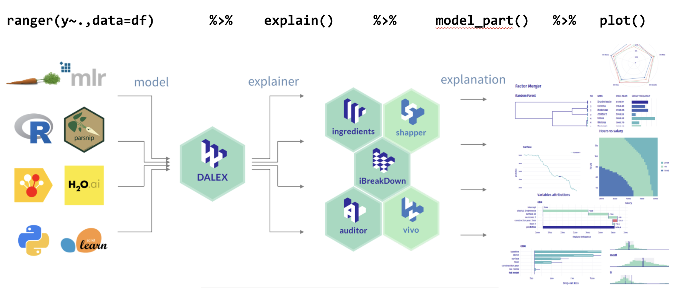

```{r setup, include=FALSE}
knitr::opts_chunk$set(echo = TRUE, message=FALSE, warning=FALSE,
                      comment="", digits = 3, tidy = FALSE, prompt = FALSE, fig.align = 'center')

```

# 모형과 데이터 불러오기 {-#titanic-model-import}

데이터와 기계학습 예측모형을 불러오자

```{r import-model-data, eval = TRUE}
library(tidyverse)

titanic_list  <-  
  read_rds("data/titinic_list.rds")

str(titanic_list, max.level = 2) 
```



# XAI 모형 아키텍처 {#xai-architecture}

일단 기계가 학습한 알고리즘(함수)이 있다면 이를 `DALEX`  팩키지 `explain` 객체로 변환시킨 후에 다양한 관점에서 모형을 설명하도록 한다.


```{r dalex-explainer}
library("rms")
library("DALEX")

## 로지스틱 분류모형 설명자(explainer)
explain_lmr <- explain(model = titanic_list$model$titanic_lmr,
                       data  = titanic %>% select(-survived),
                       y     = titanic$survived == "yes", 
                       type = "classification",
                       label = "Logistic Regression")

## Random Forest 설명자(Explainer)
library("randomForest")
explain_rf <- explain(model = titanic_list$model$titanic_rf,
                      data = titanic %>% select(-survived),
                      y = titanic$survived == "yes", 
                      label = "Random Forest")

## SVM 설명자(Explainer)
library(e1071)
explain_svm <- explain(model = titanic_list$model$titanic_svm,
                      data = titanic %>% select(-survived),
                      y = titanic$survived == "yes", 
                      label = "SVM")

## GBM 설명자(Explainer)
library(gbm)
explain_gbm <- explain(model = titanic_list$model$titanic_gbm,
                      data = titanic %>% select(-survived),
                      y = titanic$survived == "yes", 
                      label = "GBM")
```

# 모형 성능 {.tabset}

## AUC {#performance-auc}

```{r model-performance}
# 로지스틱 회귀모형 ---------------------------
eva_lr <- DALEX::model_performance(explain_lmr)

eva_lr_tbl <- eva_lr$measures %>% 
  enframe() %>% 
  mutate(performance = map_dbl(value, 1)) %>% 
  mutate(model = "LR")

# Random Forest ------------------------------
eva_rf <- DALEX::model_performance(explain_rf)

eva_rf_tbl <- eva_rf$measures %>% 
  enframe() %>% 
  mutate(performance = map_dbl(value, 1)) %>% 
  mutate(model = "RF")

# # SVM ------------------------------
# eva_svm <- DALEX::model_performance(explain_svm)
# 
# eva_svm_tbl <- eva_svm$measures %>% 
#   enframe() %>% 
#   mutate(performance = map_dbl(value, 1)) %>% 
#   mutate(model = "SVM")

# GBM ------------------------------
eva_gbm <- DALEX::model_performance(explain_gbm)

eva_gbm_tbl <- eva_gbm$measures %>% 
  enframe() %>% 
  mutate(performance = map_dbl(value, 1)) %>% 
  mutate(model = "GBM")

# 모형 성능 종합 ======================
plot(eva_lr, 
     eva_rf, 
     eva_gbm,
     # eva_svm,
     geom = "roc")
```

## 성능표 {#performance-table} 

```{r explain-performance-table}
library(reactable)

performance_tbl <- 
  bind_rows(eva_lr_tbl, eva_rf_tbl) %>% 
  # bind_rows(eva_svm_tbl) %>% 
  bind_rows(eva_gbm_tbl) %>% 
  select(-value)

performance_tbl %>% 
  pivot_wider(names_from = "model", values_from = "performance") %>% 
  reactable::reactable(columns = list(
    LR  = colDef(format = colFormat(digits = 2)),
    RF  = colDef(format = colFormat(digits = 2)),
    # SVM = colDef(format = colFormat(digits = 2)),
    GBM = colDef(format = colFormat(digits = 2))
  ))
```

