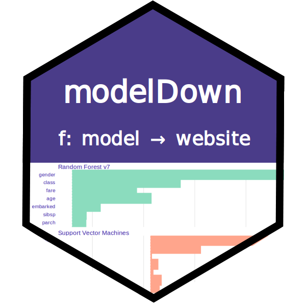

```{r setup, include=FALSE}
knitr::opts_chunk$set(echo = TRUE, message=FALSE, warning=FALSE,
                      comment="", digits = 3, tidy = FALSE, prompt = FALSE, fig.align = 'center')

```



# 데이터와 모형 {#titanic-model-data}

데이터와 기계학습 예측모형을 준비하자. `DALEX` 팩키지에 포함된 타이타닉 데이터를 준비한다.

```{r titanic-data, eval = TRUE}
library(tidyverse)

data(titanic_imputed, package = "DALEX")

head(titanic_imputed)
```

생존확률 예측 기계학습 모형을 Random Forest, GLM 두가지 종류로 개발하자.

```{r titanic-model, eval = TRUE}
titanic_rf <- ranger::ranger(survived ~ ., 
                           data = titanic_imputed, 
                           classification = TRUE, 
                           probability = TRUE)

titanic_glm <- glm(survived ~ ., 
                   data = titanic_imputed)
```

# 설명자(Explainer) {#titanic-model-data-explainer}

기계학습 모형을 설명자(Explainer) 객체로 변환시킨다.

```{r titanic-explainer}
library(modelDown)

explainer_rf <- DALEX::explain(titanic_rf,
                               data = titanic_imputed[, -8], 
                               y = titanic_imputed[, 8], 
                               verbose = FALSE)

explainer_rf
```

# XAI 보고서 {#titanic-model-data-explainer-report}

`data/modelDown_rf` 폴더에 저장시킨다.

```{r titanic-explainer-modelDown}
modelDown(explainer_rf, output_folder = "data/modelDown_rf")
```


# XAI 보고서 불러오기 {#titanic-model-data-explainer-report-recall}

[XAI 보고서](data/modelDown_rf/index.html)를 클릭하면 XAI 보고서를 HTML 형태로 받아볼 수 있다.

```{r import-modelDown, results='asis', eval = FALSE}
htmltools::includeHTML("data/modelDown_rf/index.html")
```
