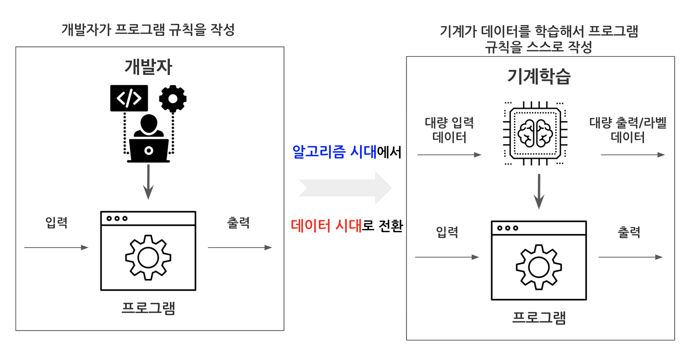
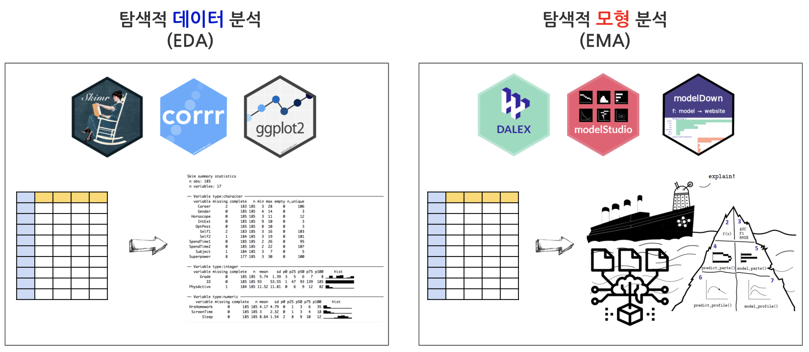

```{r setup, include=FALSE}
knitr::opts_chunk$set(echo = TRUE, message=FALSE, warning=FALSE,
                      comment="", digits = 3, tidy = FALSE, prompt = FALSE, fig.align = 'center')

```

# 알고리즘 &rarr; 데이터 [@Gianfagna2021] [@Biecek2021] [@rothman2020hands-on] {#algorithm-to-data}

과거 프로그램 규칙을 소프트웨어 엔지니어가 알고리즘을 통해서 작성했다면 인공지능 시대에는 기계가 스스로 데이터를 학습해서 작성하게 된다. 



- **모형 검증(Model Validation)**: 어떤 분이 신용대출에서 배제된다면, 블랙박스 모형을 살펴보고 배제된 사유를 설명할 수 있어야 한다. 즉, 특정 사람을 인종이나 성별, 나이 등을 이유로 편향성(Bias)이 내재된 데이터를 기계가 학습했는지 살펴볼 필요가 있다. 법원 판결, 의료정보 등 민감정보에 대한 프라이버시도 필히 준수되어야 한다. 
- **모형 디버깅(Model Debugging)**: 신뢰성(Reliability)과 강건성(Robustness)가 보장되어 입력값의 작은 변화가 출력값의 큰 결과로 이어지면 되지 않는다. 투명성(Trasparency)과 해석가능성(Interpretability)도 블랙바스 모형이 오동작 혹은 납득되지 않는 예측값을 낳았을 때 모형 디버깅을 위해서 꼭 필요하다.
- **지식발견(Knowledge Discovery)**

# EDA vs EMA {#eda-vs-ema}

**탐색적 데이터 분석(Explanatory Data Analysis)**와 **탐색적 모형 분석(Explanatory Model Analysis)**을 비교해 보자.



# EMA {#EMA}


