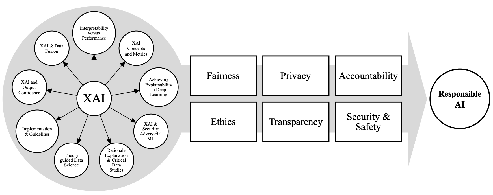
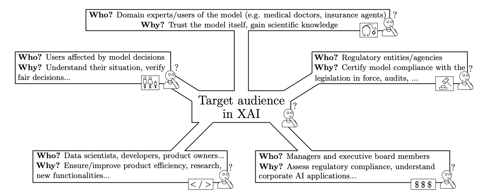
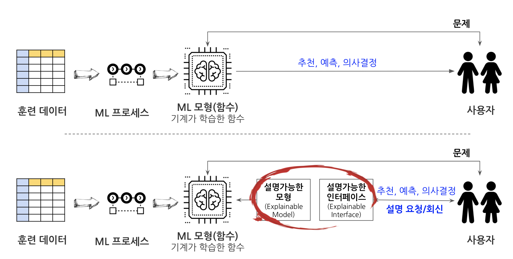
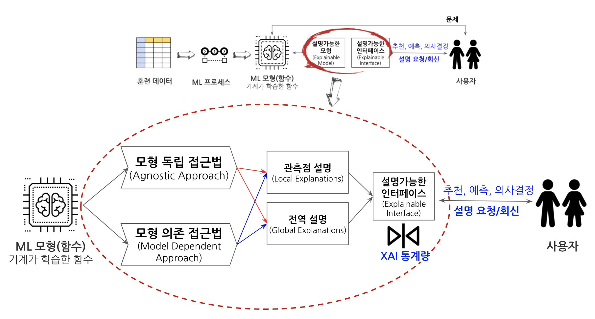
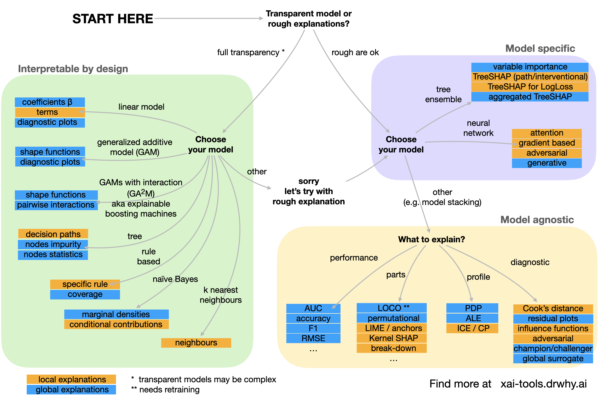
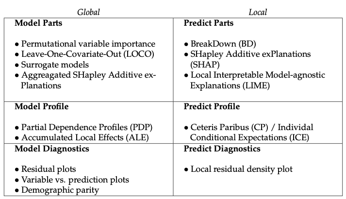

```{r setup, include=FALSE}
knitr::opts_chunk$set(echo = TRUE, message=FALSE, warning=FALSE,
                      comment="", digits = 3, tidy = FALSE, prompt = FALSE, fig.align = 'center')

```

# 책임있는 인공지능 [^1] [@smith2018the] {#responsible-ai}

[^1]: [삼성 뉴스룸 (http://bit.ly/33aZQL1), "인공지능에 책임감을 허하라!... 고개 드는 '리스폰서블 AI'론(論)"](http://bit.ly/33aZQL1)

마이크로소프트(MS)가 발행한 보고서 '컴퓨터화된 미래: 인공지능과 그 사회적 역할(The Future Computed: AI and Its Role in Society)'에서 크게 6가지를 인공지능이 갖춰야 하는 덕목으로 공정성(fairness), 신뢰성(reliability), 프라이버시와 보안성(privacy & security), 포괄성(inclusiveness), 투명성(transparency), 점검 가능성(accountability) 을 꼽고 있으며 이를 다하는 인공지능을 책임 있는 인공지능(responsible AI)으로 보고 있다.

우선 우선 공정성 얘기부터. '인공지능이 **공정**해야 한다'는 명제엔 '모든 이를 공평하고 균형 잡힌 방식으로 대하는 인공지능 체계'란 전제가 깔려있다. 어떤 정보도 특정 집단에게 보다 유리한 방향으로 제공돼선 안 된단 얘기다. 인공지능은 누구나 믿고 활용할 수 있을 만큼 **안전하되(신뢰성)**, 사용자의 신상 정보는 철저히 보호되도록 설계돼야 한다**(프라이버시와 보안성)**. 실제로 구동될 땐 모든 경우의 수를 따져, 모든 관련 인물을 고려하는 게 기본**(포괄성)**이다. 또한 누구든 그 '속'을 들여다보고자 하면 시간과 장소에 관계 없이 해당 기술이 어떤 알고리즘으로, 어떤 데이터를 분석해 도출됐는지 알 수 있도록 설계돼야 한다**(투명성)**. 마지막으로 이 모든 작업의 진행 상황은 첨단 모니터링 시스템을 통해 언제고 파악될 수 있어야 한다**(점검 가능성)**.



# XAI 관심있으신 분들 [@arrieta2019explainable] {#xai-stakeholders}

XAI를 바라로보는 관점은 서로 다른 이해관계를 갖고 있기 때문에 다양한 목적이 존재한다. 예를 들어 규제당국은 관련 법률을 AI가 잘 준수하는지 관심이 있으며, AI를 통해 영리를 추구하는 기업체나 관련 스타트업에 종사하는 임원을 비롯한 관리자 분들은 AI 제품을 이해하고 규제 당국의 법규를 잘 준수하는지 관심이 있고, 의료나 과학쪽 종사자분들은 AI의 신뢰성과 과학적 발견을 할 수 있는지에 관심이 있다. AI 알고리즘에 영향을 받는 예를 들어, 배달 플랫폼 노동자들은 상황을 이해하고 AI가 공정한 결정을 내렸는지에 관심이 있다. 데이터 과학자를 비롯한 AI 개발자는 성능을 높이고 새로운 기능을 추가하는 등 개발된 알고리즘을 더 잘 이해하고 이를 다음 단계로 더 높은 성능을 내는데 관심이 있다.



# 알고리즘 → 데이터 [@Gianfagna2021] [@Biecek2021] [@rothman2020hands-on] {#algorithm-to-data}

과거 프로그램 규칙을 소프트웨어 엔지니어가 알고리즘을 통해서 작성했다면 인공지능 시대에는 기계가 스스로 데이터를 학습해서 작성하게 된다. XAI가 필요한 사유는 다음과 같다.


-   **모형 검증(Model Validation)**: 어떤 분이 신용대출에서 배제된다면, 블랙박스 모형을 살펴보고 배제된 사유를 설명할 수 있어야 한다. 즉, 특정 사람을 인종이나 성별, 나이 등을 이유로 편향성(Bias)이 내재된 데이터를 기계가 학습했는지 살펴볼 필요가 있다. 법원 판결, 의료정보 등 민감정보에 대한 프라이버시도 필히 준수되어야 한다.

    -   글로벌 데이터셋 수준 설명(Dataset Level Explanation)은 기계학습 모형을 감사(Audit)할 때 도움이 된다. 즉, 모형이 요구사항을 준수하는지 확인할 수 있다.
    -   전문가 지식과 모형을 견주어 서로 일치하는 경우 예측에 대한 신뢰를 부여할 수 있다.

-   **모형 디버깅(Model Debugging)**: 신뢰성(Reliability)과 강건성(Robustness)가 보장되어 입력값의 작은 변화가 출력값의 큰 결과로 이어지면 되지 않는다. 투명성(Trasparency)과 해석가능성(Interpretability)도 블랙바스 모형이 오동작 혹은 납득되지 않는 예측값을 낳았을 때 모형 디버깅을 위해서 꼭 필요하다.

    -   관측점 수준 설명(Instance Level Explanation)은 기계학습 모형을 디버깅할 때 유용하다. 즉, 왜 모형이 잘못되었는지 설명할 수 있다.

-   **지식발견(Knowledge Discovery)**

    -   챔피언-도전자 분석 사례 등 다양한 모형 분석작업이 수행될 때 모형을 면밀히 조사할 수 있다.
    -   모형 예측을 활용할 때 어떤 작업이 필요한가에 대해서 이해를 높일 수 있다.

# XAI 작업흐름 [^2] {#xai-workflow}

[^2]: [Dr. Matt Turek, "Explainable Artificial Intelligence (XAI)", DARPA](https://www.darpa.mil/program/explainable-artificial-intelligence)

과거 기계가 학습한 함수 즉, 기계학습 모형은 추천, 예측(prediction), 의사결정(classification) 결과값만을 사용자에게 전달하였다. 예측력이 좋아서 유용성은 인정받았지만 다음 질문에 대한 답을 제시하지 못한 아쉬움도 있다.

-   AI가 왜 그렇게 동작하는가?
-   왜 다르게 동작하지는 않는가?
-   사용자가 언제 AI를 믿을 수 있을까?

하지만, XAI를 통하게 되면 기본적인 예측력에 대한 도움을 받을 수 있을 뿐만 아니라 다음 질문에 대해서는 도움을 받을 수가 있다.

-   AI가 동작하는 이유를 이해한다.
-   AI가 동작하지 않는 이유도 이해한다.
-   어느 시점에 AI를 믿어야할지 알게 된다.

XAI 작업흐름은 다음과 같은데, 설명가능한 모형을 만들어 인터페이스를 제작하여 또다른 형태의 객체(함수)를 만들어 기계가 학습한 모형(함수)에 대해 파악하게 된다.



## 한걸음 더 들어감 {#move-step-forwards}

기계가 데이터를 통해 학습한 모형(함수)를 설명가능한 모형으로 살펴보는 접근 방법은 크게 두가지로 나뉜다. 하나는 모형에 독립적인 접근법(Agnostic Approach)과 모형 의존적인 접근방법(Model Dependent Approach)로 나뉘고 관측점 하나를 설명하느냐 전체를 설명하느냐에 따라 나뉜다. 하지만 설명가능한 인터페이스는 하나로 정리된다.



# EDA vs EMA {#eda-vs-ema}

**탐색적 데이터 분석(Explanatory Data Analysis)**와 **탐색적 모형 분석(Explanatory Model Analysis)**을 비교해 보자.


## XAI 분류 흐름도 [^3] {#xai-landscape}

[^3]: [Szymon Maksymiuk, Alicja Gosiewska, and Przemysław Biecek, "Landscape of R packages for eXplainable Artificial Intelligence"](http://xai-tools.drwhy.ai/)



## XAI 분류 {#xai-taxonomy}



## `DALEX` {#DALEX}


